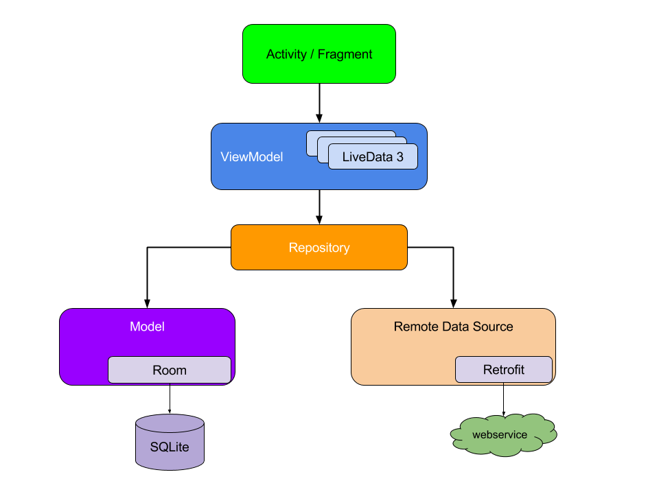

# Android MVVM sample app that uses kotlin coroutines flow (without LiveData)

This is a sample app that uses kotlin coroutines.

It is MVVM Architecture without [LiveData].

The app shows list public repositories for the specified user. You can enter the user name in the SearchBar at the top of screen. The default user name is "Google"

## Testing Purpose (Use it when got Limit exception)

Comment this line: 

single<RepoRepository> { RepoRepositoryImpl(get()) }.

Uncomment this line: 
  
single<RepoRepository> { FakeRepoRepository(get()) }.
  
```kotlin
val appModule = module {
  // data/repository
  single<RepoRepository> { RepoRepositoryImpl(get()) }

  // testing purpose
//    single<RepoRepository> { FakeRepoRepository(get()) }
}
```

## Architecture



### ViewModel -> View

Use kotlin coroutines flow with [StateFlow] and [ShareFlow].

Transformed to hot stream with [ViewModelScope]

```kotlin
class ListRepoViewModel(private val repoRepository: RepoRepository) : ViewModel() {

    private val _userName = MutableStateFlow("Google")

    val repoFlow: Flow<PagingData<Repo>> = _userName
        .flatMapLatest {
            repoRepository.getRepoList(it)
        }
        .cachedIn(viewModelScope)
}
```

Bind to view with [LifecycleScope].

```kotlin
inline fun <T> Fragment.bind(
    source: Flow<T>,
    crossinline action: suspend (T) -> Unit
) {
    source.flowWithLifecycle(viewLifecycleOwner.lifecycle, Lifecycle.State.STARTED)
        .onEach { action.invoke(it) }
        .launchIn(viewLifecycleOwner.lifecycleScope)
}
```

```kotlin
class ListRepoFragment : BaseFragment<FragmentListRepoBinding>() {
    ...
    private fun observe() {
        bind(viewModel.repoFlow) {
            adapter.submitData(it)
        }
    }
}
```

### View -> ViewModel

Call a ViewModel function, and emit to [MutableSharedFlow]

```kotlin
class DetailsRepoViewModel(
    private val userName: String,
    private val repoName: String,
    private val repository: RepoRepository
) : ViewModel() {

    private val loadEvent = MutableSharedFlow<Unit>()

    private val repo = loadEvent
        .flatMapLatest {
            repository.getRepoDetail(userName, repoName)
        }.stateIn(viewModelScope, SharingStarted.Eagerly, Resource.Loading)

    val isLoading = repo.map { it.isLoading }
    val isFail = repo.map { it.isFail }
    val data = repo.map { it.valueOrNull }

    init {
        submit()
    }

    fun retry() {
        submit()
    }

    fun submit() {
        viewModelScope.launch {
            loadEvent.emit(Unit)
        }
    }
}
```

### View <-> ViewModel (2-way data binding)

Combine the above two.

```kotlin
class DetailRepoFragment : BaseFragment<FragmentDetailRepoBinding>() {

    private val args: DetailRepoFragmentArgs by navArgs()

    private val viewModel: DetailsRepoViewModel by viewModel {
        parametersOf(args.user, args.repo)
    }


    override fun layoutRsc() = R.layout.fragment_detail_repo

    override fun viewReady() {
        bind(viewModel.isLoading) {
            binding.isLoading = it
        }
        bind(viewModel.isFail) {
            binding.isFail = it
        }
        bind(viewModel.data) {
            binding.repo = it
        }

        binding.error.setOnClickRetryButton {
            viewModel.retry()
        }
    }
}
```

## Libraries

* [kotlin](https://kotlinlang.org/)
    * [kotlin coroutines](https://github.com/Kotlin/kotlinx.coroutines)
* [androidx](https://developer.android.com/jetpack/androidx)
    * [appcompat](https://developer.android.com/jetpack/androidx/releases/appcompat)
    * [android ktx](https://developer.android.com/kotlin/ktx)
    * [constraintlayout](https://developer.android.com/reference/android/support/constraint/ConstraintLayout)
    * [lifecycle](https://developer.android.com/jetpack/androidx/releases/lifecycle)
* [material-components](https://github.com/material-components/material-components-android)
* [Room Paging](https://developer.android.com/topic/libraries/architecture/paging/v3-overview)
* [navigation](https://developer.android.com/topic/libraries/architecture/paging/v3-overview](https://developer.android.com/guide/navigation/navigation-getting-started)
* [coil](https://github.com/coil-kt/coil)
* [koin](https://github.com/InsertKoinIO/koin)
* [retrofit](https://github.com/square/retrofit)
* [okhttp](https://github.com/square/okhttp)
* [moshi](https://github.com/square/moshi)

